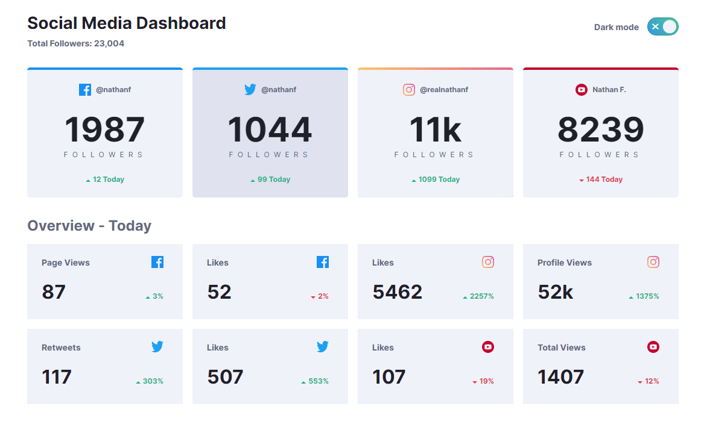
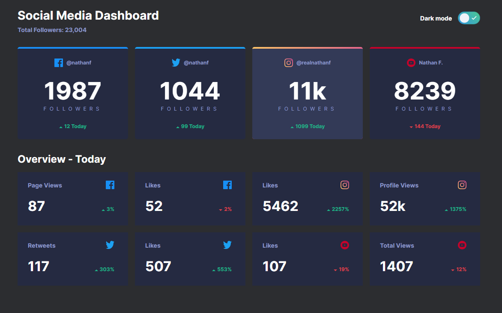
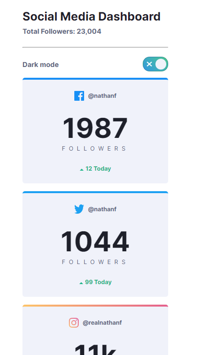
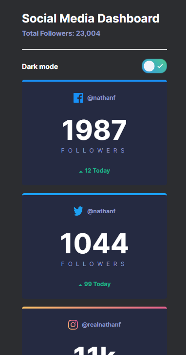

# Frontend Mentor - Social media dashboard with theme switcher solution

This is a solution to the [Social media dashboard with theme switcher challenge on Frontend Mentor](https://www.frontendmentor.io/challenges/social-media-dashboard-with-theme-switcher-6oY8ozp_H). Frontend Mentor challenges help you improve your coding skills by building realistic projects.

## Table of contents

- [Overview](#overview)
  - [The challenge](#the-challenge)
  - [Screenshot](#screenshot)
  - [Links](#links)
- [My process](#my-process)
  - [Built with](#built-with)
  - [What I learned](#what-i-learned)
  - [Continued development](#continued-development)
  - [Useful resources](#useful-resources)
- [Author and acknowledgments](#author-and-acknowledgments)

## Overview

### The challenge

Users should be able to:

- View the optimal layout for the site depending on their device's screen size
- See hover states for all interactive elements on the page
- Toggle color theme to their preference

### Screenshot

#### Desktop views

#### Mobile views

### Links

- Solution URL: coming soon...
- [Live site](https://dashboard-theme-toggle.web.app/)

## My process

### Built with

- Semantic HTML5 markup
- CSS custom properties
- Flexbox
- CSS Grid
- Mobile-first workflow
- [React](https://reactjs.org/) - JS library

### What I learned

- Using `linear-gradient` on borders with `border-radius`
- Considerations in making an accessible toggle button

### Continued development

I can improve the solution by:

- Saving the user theme choice in local storage for their next visit
- Use the `prefers-color-scheme` media query to set the theme to their OS preference.

### Useful resources

- ['An accessible toggle' by Kitty Giraudel](https://kittygiraudel.com/2021/04/05/an-accessible-toggle) - A detailed walkthrough of a HTML + CSS only implementation of an accessible toggle. This inspired me to include the check and cross icons in the toggle to make the choices clearer.
- ['A complete guide to dark mode on the web' by CSS Tricks](https://css-tricks.com/a-complete-guide-to-dark-mode-on-the-web/) - Outlines different approaches to implementing dark mode.

## Author and acknowledgments

- Coded by En-Chi Liu - [GitHub profile](https://github.com/eeels22)
- Challenge, UI design and icons provided by [Frontend Mentor](https://www.frontendmentor.io)
